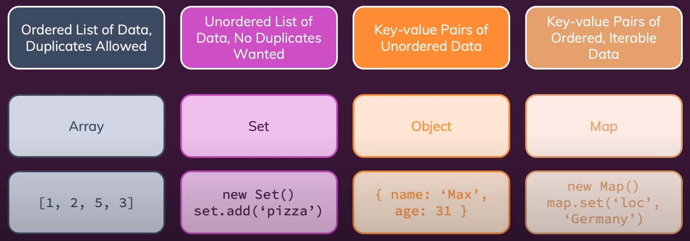
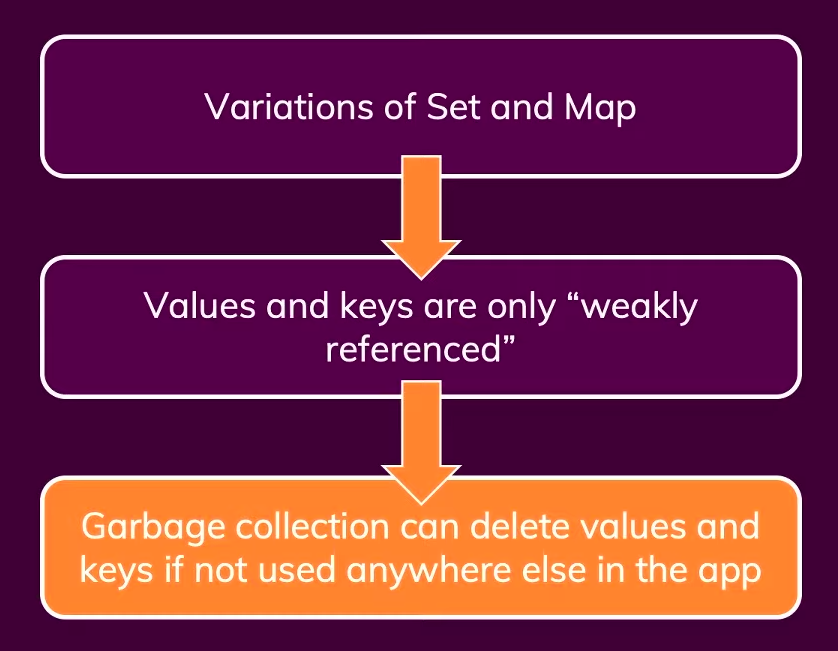

# INBUILT JS DATA STRUCTURES

Inbuilt data structures are:

## TYPES OF JAVASCRIPT DATA STRUCTURES

### INBUILT DATA STRUCTURE

- Linear data structure

  - Array
  - Set

- Key-Value store data structure

  - Object
  - Map

- WEAKSET AND WEAKMAP

Gives Memory gain and app performance by eliminating all app-wide unused, keys(Maps) and values(Set) in the Set/Map as they are "weakly referenced".
They can only take in Objects as keys/values.

For more information on WeakSet and WeakMaps
[https://javascript.info/weakmap-weakset]

### CUSTOM DATA STRUCTURE

- Stack (LIFO)
- Queue (FIFO)
- Linked List
