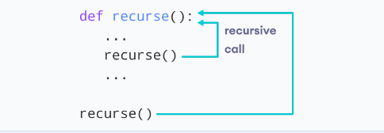

# WHAT IS RECURSION?

Recursion is the process of defining something in terms of itself.

A physical world example would be to place two parallel mirrors facing each other. Any object in between them would be reflected recursively.

We know that a function can call other functions. It is even possible for the function to call itself. These types of construct are termed as recursive functions.

Our recursion ends when the number reduces to 1. This is called the base condition.

Every recursive function must have a base condition that stops the recursion or else the function calls itself infinitely.

- The Python interpreter limits the depths of recursion to help avoid infinite recursions, resulting in stack overflows. By default, the maximum depth of recursion is 1000.

- The maximal recursion depth is limited by JavaScript engine. We can rely on it being 10,000, some engines allow more, but 100,000 is probably out of limit for the majority of them.

## Advantages of Recursion

1. Recursive functions make the code look clean and elegant.
2. A complex task can be broken down into simpler sub-problems using recursion.
3. Sequence generation is easier with recursion than using some nested iteration.

## Disadvantages of Recursion

1. Sometimes the logic behind recursion is hard to follow through.
2. Recursive calls are expensive (inefficient) as they take up a lot of memory and time.
3. Recursive functions are hard to debug.

## DIVIDE AND CONQUER ALGORITHMS

Here are the steps involved:

1. Divide: Divide the given problem into sub-problems using recursion.
2. Conquer: Solve the smaller sub-problems recursively. If the subproblem is small enough, then solve it directly.
3. Combine: Combine the solutions of the sub-problems that are part of the recursive process to solve the actual problem.

### DIVIDE AND CONQUER VS DYNAMIC APPROACH

The divide and conquer approach divides a problem into smaller sub-problems; these sub-problems are further solved recursively. The result of each subproblem is not stored for future reference, whereas, in a dynamic approach, the result of each subproblem is stored for future reference.

Use the divide and conquer approach when the same subproblem is not solved multiple times. Use the dynamic approach when the result of a subproblem is to be used multiple times in the future.

### Divide and Conquer Applications

- Binary Search
- Merge Sort
- Quick Sort
- Strassen's Matrix multiplication
- Karatsuba Algorithm
