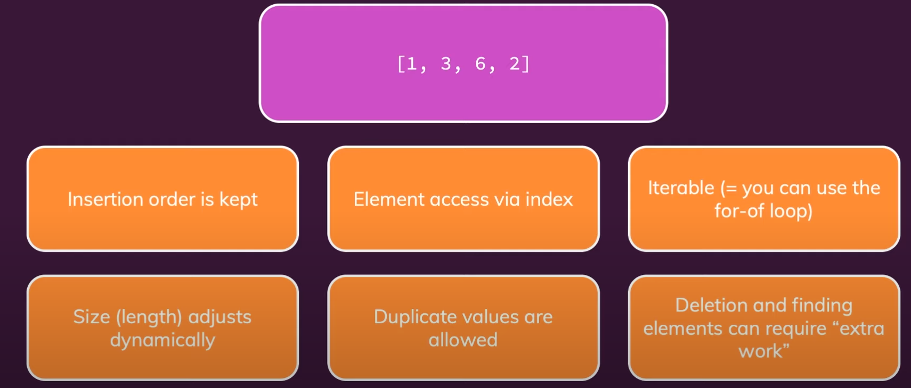

# ARRAYS

Arrays properties are:

Arrays methods are:

Details about these methods are here:

## Static vs Dynamic Arrays

Static - Fixed/Allocated size of arrays length
Dynamic - Can always copy and rebuild an array in a different location to increase the array size. Dynamic arrays are copied by doubling the space allocation.
