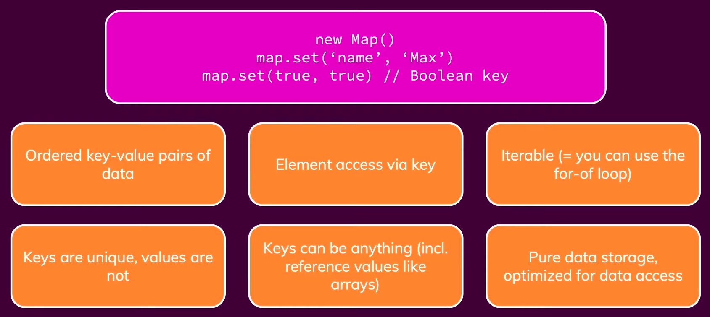
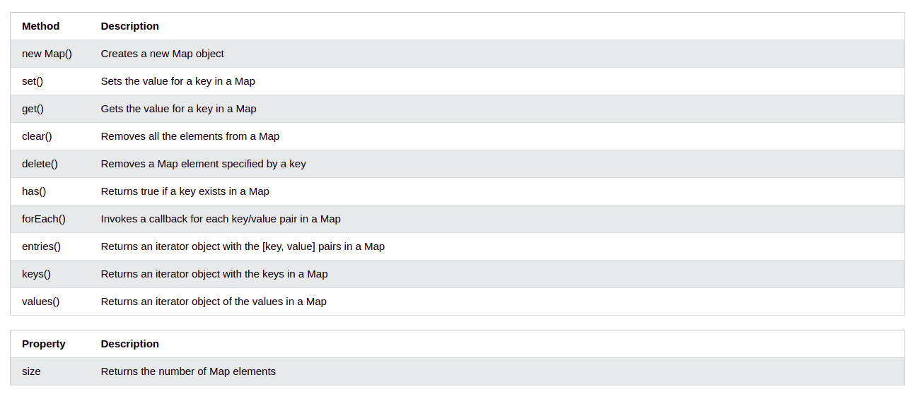

# MAP

Map properties are:

Map methods are:

Details about these methods are here:

## Static vs Dynamic Arrays

1. The key is that it is strictly a data store as methods are not allowed. Only store final data into Maps.

## Objects vs Maps

