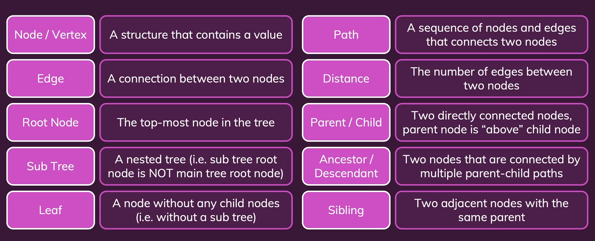
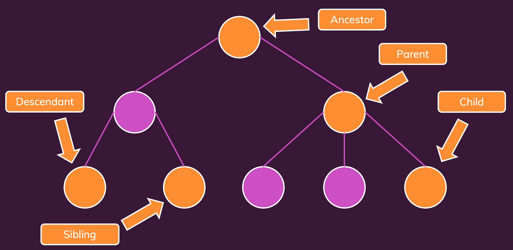
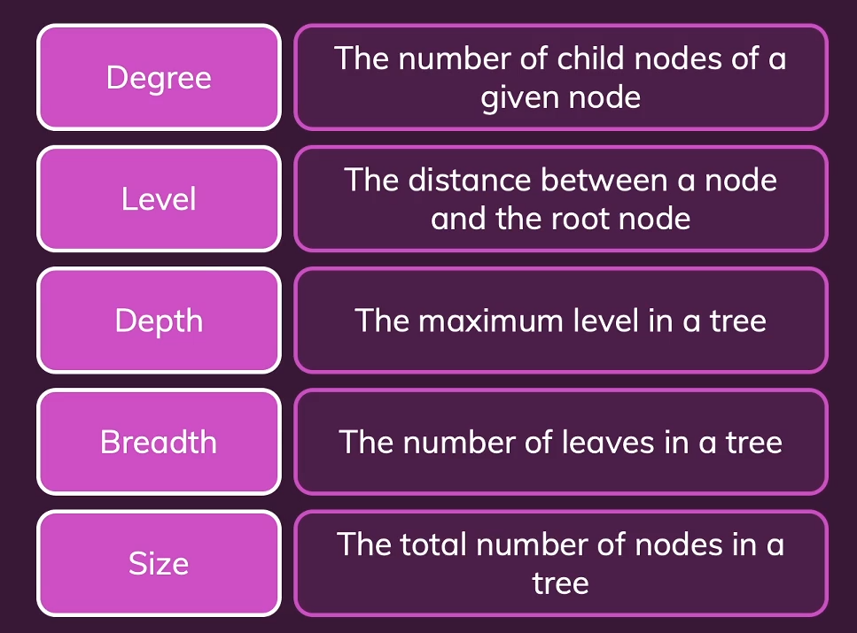
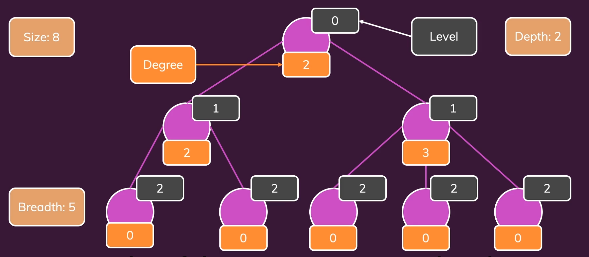
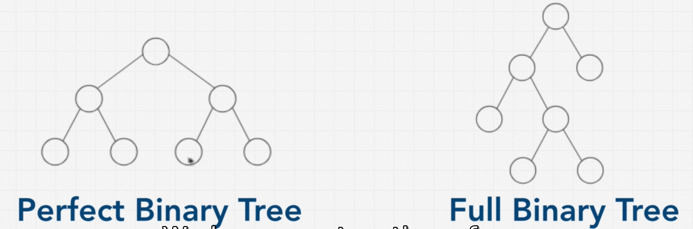
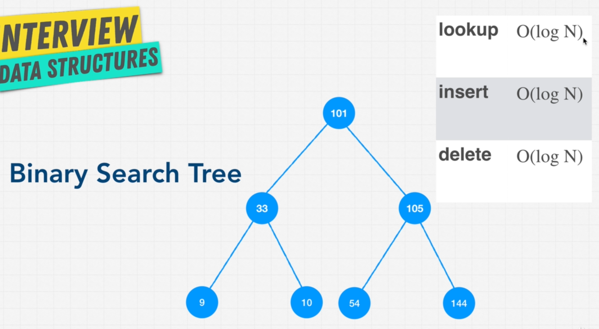

# TREE

## BINARY TREE & BINARY SEARCH TREE

Each Node can only have two children.

When Binary trees are perfect:

1. The number of Nodes doubles as we move down the tree.
2. The number of Nodes on the last level is equal to the sum of all the number of Nodes on other levels + 1 (i.e about half of the Nodes are leaves or on the last level).

`Number of Nodes = 2 ^ Tree depth/height - 1;`

Binary Search Tree makes search easy as they maintain relationships compared to hash tables.

RULES:

1. All child Nodes to the right must be greater than the current Node.
2. A Node can only have up to two children.

### BALANCED VS UNBALANCED BINARY SEARCH TREES

This tree turns into a LinkedList with an O(n) access time. So we need to balance it. We use a Red-Black tree or an AVL tree to balance it.

Read about Red-Black tree and AVL Tree here: [https://stackoverflow.com/questions/13852870/red-black-tree-over-avl-tree]

## PRIORITY QUEUE

Uses orders and Inserts are fast and lookups are fast. Bubbles up to level out and re-arrange

Uses Heaps, heaps uses trees and auto inserts from left to right as they are auto balancing.
Max heap - Top higher than bottom
Min Heap - Top less than bottom

## TRIE

Also called a Prefix Tree and is a specialized tree used in searching mostly with text. Empty root node then adds letters. Used for Auto completion.
