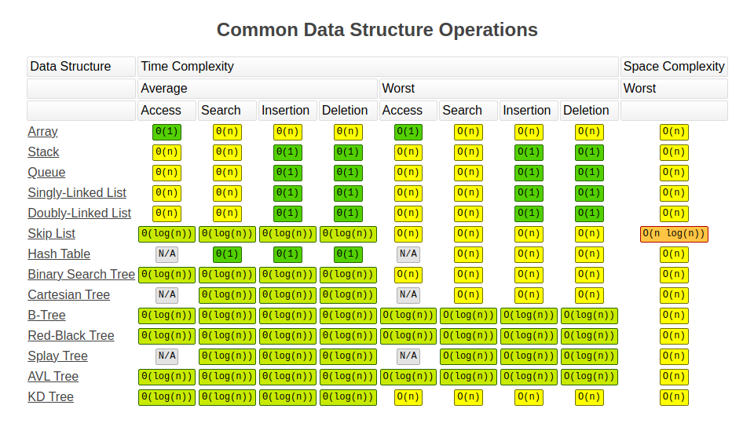
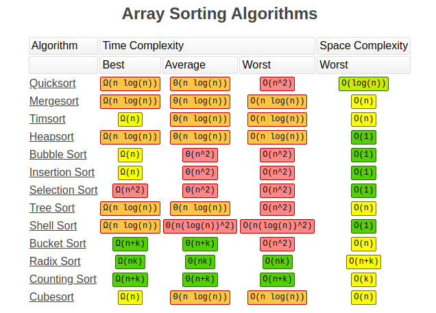
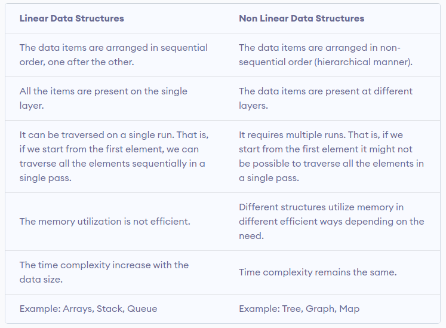
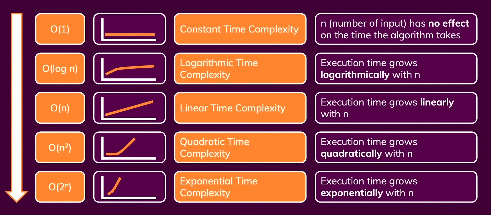

# DATA STRUCTURES AND ALGORITHMS

This is my documentation for data structures and algorithms, consisting of implementations in JavaScript (TypeScript) and Python.

## ALGORITHMS

In computer programming terms, an algorithm is a set of well-defined instructions to solve a particular problem. It takes a set of input and produces a desired output.

### Qualities of Good Algorithms

1. Input and output should be defined precisely.
2. Each step in the algorithm should be clear and unambiguous.
3. Algorithms should be most effective among many different ways to solve a problem.
4. An algorithm shouldn't include computer code. Instead, the algorithm should be written in such a way that it can be used in different programming languages.

#### Example Algorithm 1: Add two numbers entered by the user

`Step 1: Start

Step 2: Declare variables num1, num2 and sum.

Step 3: Read values num1 and num2.

Step 4: Add num1 and num2 and assign the result to sum.
        sum←num1+num2

Step 5: Display sum

Step 6: Stop`

## DATA STRUCTURES

Data structure is a storage that is used to store and organize data. It is a way of arranging data on a computer so that it can be accessed and updated efficiently.

### TYPES OF DATA STRUCTURES

- Linear data structure

  - Array
  - Object
  - Map
  - Set
  - Stack (LIFO)
  - Queue (FIFO)
  - Linked List

- Non-linear data structure

  - Graph
    - Spanning Tree and Minimum Spanning Tree
    - Strongly Connected Components
    - Adjacency Matrix
    - Adjacency List

  - Trees
    - Binary Tree
    - Binary Search Tree
    - AVL Tree
    - B-Tree
    - B+ Tree
    - Red-Black Tree

### ACCESS METHODS COMPARISON

### LINEAR VS NON-LINEAR DATA STRUCTURES

Copyright [programiz.com]

## ASYMPTOTIC NOTATIONS

Asymptotic notations are the mathematical notations used to describe the running time of an algorithm when the input tends towards a particular value or a limiting value.

### TYPES

- Big-O notation (O-notation)
    Big-O notation represents the upper bound of the running time of an algorithm. Thus, it gives the worst-case complexity of an algorithm.

    
    

- Omega notation (Ω-notation)
    Omega notation represents the lower bound of the running time of an algorithm. Thus, it provides the best case complexity of an algorithm.

- Theta notation (Θ-notation)
    Theta notation encloses the function from above and below. Since it represents the upper and the lower bound of the running time of an algorithm, it is used for analyzing the average-case complexity of an algorithm.

### Master Theorem

The master theorem is used in calculating the time complexity of recurrence relations (divide and conquer algorithms) in a simple and quick way.

`T(n) = aT(n/b) + f(n),
where,
n = size of input
a = number of sub-problems in the recursion
n/b = size of each subproblem. All sub-problems are assumed
     to have the same size.
f(n) = cost of the work done outside the recursive call,
      which includes the cost of dividing the problem and
      cost of merging the solutions

Here, a ≥ 1 and b > 1 are constants, and f(n) is an asymptotically positive function.`

#### Master Theorem Explanation

If a ≥ 1 and b > 1 are constants and f(n) is an asymptotically positive function, then the time complexity of a recursive relation is given by

`T(n) = aT(n/b) + f(n)

where, T(n) has the following asymptotic bounds:

    1. If f(n) = O(nlogb a-ϵ), then T(n) = Θ(nlogb a).

    2. If f(n) = Θ(nlogb a), then T(n) = Θ(nlogb a * log n).

    3. If f(n) = Ω(nlogb a+ϵ), then T(n) = Θ(f(n)).

ϵ > 0 is a constant.`

Each of the above conditions can be interpreted as:

1. If the cost of solving the sub-problems at each level increases by a certain factor, the value of `f(n)` will become polynomially smaller than `nlogb a`. Thus, the time complexity is oppressed by the cost of the last level ie. `nlogb a`
2. If the cost of solving the sub-problem at each level is nearly equal, then the value of `f(n)` will be `nlogb a`. Thus, the time complexity will be `f(n)` times the total number of levels ie. `nlogb a * log n`
3. If the cost of solving the subproblems at each level decreases by a certain factor, the value of `f(n)` will become polynomially larger than `nlogb a`. Thus, the time complexity is oppressed by the cost of `f(n)`.

#### Master Theorem Limitations

The master theorem cannot be used if:

1. `T(n)` is not monotone. eg. `T(n) = sin n`
2. `f(n)` is not a polynomial. eg. `f(n) = 2n`
3. `a` is not a constant. eg. `a = 2n`
4. `a < 1`
